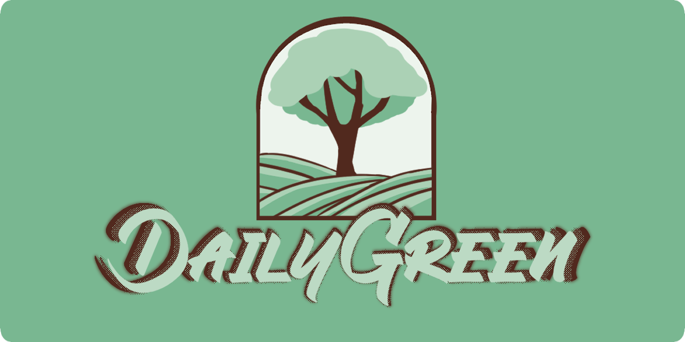

# DailyGreen

[![Contributors][contributors-shield]][contributors-url]
[![Forks][forks-shield]][forks-url]
[![Stargazers][stars-shield]][stars-url]
[![Issues][issues-shield]][issues-url]
[![Unlicense License][license-shield]][license-url]



**DailyGreen é uma plataforma colaborativa para promover práticas sustentáveis, conectar pessoas e divulgar eventos relacionados ao meio ambiente.**

---

## Sobre o Projeto

DailyGreen é um projeto open source que visa criar uma comunidade engajada em sustentabilidade, oferecendo um espaço para discussões, compartilhamento de experiências e divulgação de eventos ecológicos. O projeto está em desenvolvimento e utiliza tecnologias modernas para desktop.

---

### Controlador de verção e Editor

- [![GITHUB][GITHUB]][GITHUB-url] [![GIT][GIT]][GIT-url]
- [![INTELLIJ][INTELLIJ IDEA]][INTELLIJ IDEA-url]

---

### Tecnologias Utilizadas

- [![Java][JAVA.java]][JAVA-url]
- [![JavaFX][JavaFX.java]][JavaFX-url]
- [![Maven][MAVEN.xml]][Maven-url]

---

## Funcionalidades

- Cadastro e login de usuários
- Fórum para discussões sobre sustentabilidade
- Compartilhamento de experiências e dicas ecológicas
- Divulgação e gerenciamento de eventos sustentáveis
- Sistema de comentários e interação entre usuários

---

## Como rodar o projeto

### Versão Desktop (JavaFX)

1. Certifique-se de ter o Java 23 e o Maven instalados.
2. Clone o repositório:
    ```bash
    git clone https://github.com/Garudaakuma/DailyGreen-Project.git
    ```

---

## Contribuidores

<a href="https://github.com/LucasAioriaSerpa/DailyGreen-Project/graphs/contributors">
  
</a>

- [LucasAioriaSerpa](https://github.com/LucasAioriaSerpa)
- [flaviacfagundes](https://github.com/flaviacfagundes)
- [Nikolas2606](https://github.com/Nikolas2606)
- [joao-au](https://github.com/joao-au)

---

<!-- ## Licença

Este projeto está sob a licença Unlicense. Veja mais em [LICENSE.txt](https://github.com/Garudaakuma/DailyGreen-Project/blob/master/LICENSE.txt).

---

## Contato

Para dúvidas, sugestões ou contribuições, abra uma issue ou entre em contato com um dos membros do projeto pelo GitHub.

--- -->

<!-- Shields e links -->
[contributors-shield]: https://img.shields.io/github/contributors/LucasAioriaSerpa/DailyGreen-JavaFX.svg?style=for-the-badge
[contributors-url]: https://github.com/LucasAioriaSerpa/DailyGreen-JavaFX/graphs/contributors
[forks-shield]: https://img.shields.io/github/forks/Garudaakuma/DailyGreen-Project.svg?style=for-the-badge
[forks-url]: https://github.com/LucasAioriaSerpa/DailyGreen-JavaFX/network/members
[stars-shield]: https://img.shields.io/github/stars/Garudaakuma/DailyGreen-Project.svg?style=for-the-badge
[stars-url]: https://github.com/LucasAioriaSerpa/DailyGreen-JavaFX/stargazers
[issues-shield]: https://img.shields.io/github/issues/Garudaakuma/DailyGreen-Project.svg?style=for-the-badge
[issues-url]: https://github.com/LucasAioriaSerpa/DailyGreen-JavaFX/issues
[license-shield]: https://img.shields.io/github/license/Garudaakuma/DailyGreen-Project.svg?style=for-the-badge
[license-url]: https://github.com/LucasAioriaSerpa/DailyGreen-JavaFX/blob/master/LICENSE.txt

[GITHUB]: https://img.shields.io/badge/github-%23121011.svg?style=for-the-badge&logo=github&logoColor=white
[GITHUB-url]: https://github.com

[GIT]: https://img.shields.io/badge/git-%23F05033.svg?style=for-the-badge&logo=git&logoColor=white
[GIT-url]: https://git-scm.com/doc

[INTELLIJ IDEA]: https://img.shields.io/badge/IntelliJIDEA-000000.svg?style=for-the-badge&logo=intellij-idea&logoColor=white
[INTELLIJ IDEA-url]: https://www.jetbrains.com/idea/

[JAVA.java]: https://img.shields.io/badge/Java-ED8B00?style=for-the-badge&logo=openjdk&logoColor=white
[JAVA-url]: https://docs.oracle.com/en/java/javase/23/index.html

[JavaFX.java]: https://img.shields.io/badge/javafx-%23FF0000.svg?style=for-the-badge&logo=javafx&logoColor=white
[JavaFX-url]: https://docs.oracle.com/javase/8/javase-clienttechnologies.html

[MAVEN.xml]: https://img.shields.io/badge/MAVEN-C71A36?logo=apache-maven
[Maven-url]: https://maven.apache.org/guides/index.html
